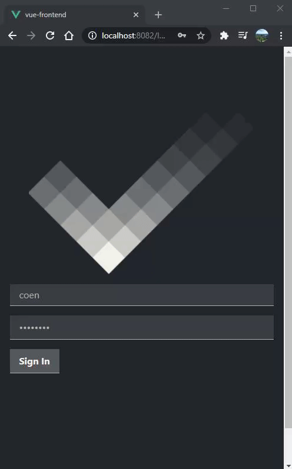

# VibeCheck
School project for S-FUN4 

## Description

VibeCheck is a Vue.js based application, using a REST api as the communication. VibeCheck is connected to a small REST api written in Java, using Spring Boot. This was my first interaction with REST api's and it is developed for local use only. I know that beats the purpose of using a REST api, but it was a great exercise.

## App Feel



## Project setup
```
npm install
```

### Compiles and hot-reloads for development
```
npm run serve
```

### Compiles and minifies for production
```
npm run build
```

### Lints and fixes files
```
npm run lint
```

### Customize configuration
See [Configuration Reference](https://cli.vuejs.org/config/).
